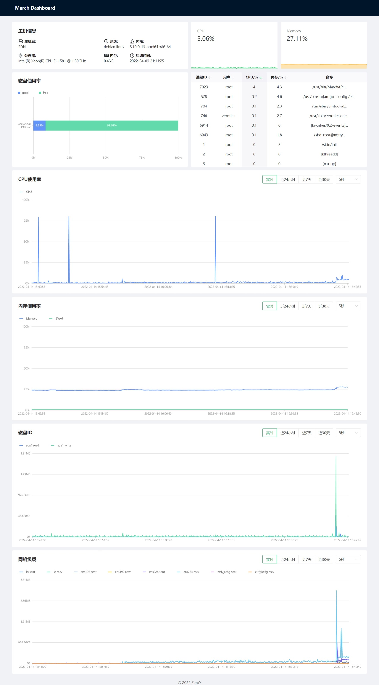

# March

使用 go+vue 开发的一个 简易 linux 系统监控

## 已实现

- CPU 使用率监控
- 内存使用率监控
- SWAP 使用率监控
- 进程监控
- 磁盘 IO 监控
- 网络负载

## 使用方法

### 数据库

采用mongodb作为系统历史监控数据的存储引擎，建议使用docker的方式运行

```sh
docker run -d --name some-mongo \
    -e MONGO_INITDB_ROOT_USERNAME=mongoadmin \
    -e MONGO_INITDB_ROOT_PASSWORD=secret \
    -p 27017:27017
    mongo
```

### 构建

```sh
yarn run build  # 构建前端
CGO_ENABLED=0 go build -a -ldflags '-extldflags "-static"' .  # 构建后端
```

### 配置文件

```sh
{
 "dbHost": "127.0.0.1",  # mongodb的ip
 "dbPort": "27017",      # mongodb的端口
 "dbUser": "admin",      # mongodb的用户名
 "dbPass": "admin",      # mongodb的密码
 "dbName": "march",      # mongodb数据库名
 "secretKey": "123456",  # 暂未使用
 "localWeb": true,       # 是否开启本地WebUI
 "webPort": 52080        # Web的端口
}
```

强烈建议将March配置为systemd服务
您需要将编译好的web文件放到编译好march-api的二进制文件运行目录下的web文件夹里  
例如:

```sh
.
├── config.json  # 配置文件
├── MarchAPI     # 编译后的march-api二进制文件
├── web          # WebUI目录  存放编译好的march-web文件
│   ├── assets
│   │   ├── FiraCode-Regular.f13d1ece.woff2
│   │   ├── index.185cece5.js
│   │   └── index.f32dadc3.css
│   ├── favicon.ico
│   └── index.html
```

## 页面截图


